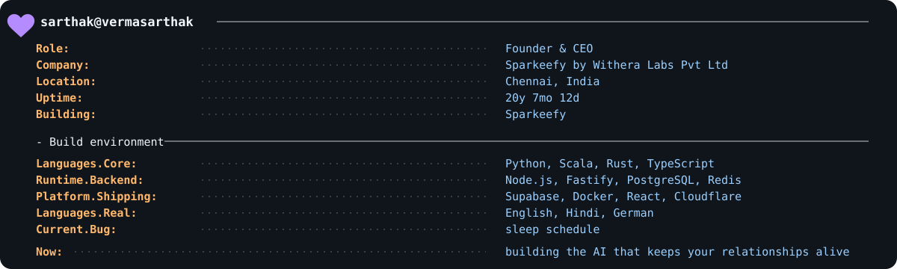

<picture>
  <source media="(max-width: 600px)" srcset="./assets/founder-system-mobile.svg">
  
</picture>

## Featured Systems

- **[PagedServe](https://github.com/vermasarthak/pagedserve)** — Experimental LLM inference runtime with block-based KV memory management, continuous batching, prefix caching, and direct blockwise attention.
- **[Cairn](https://github.com/vermasarthak/cairn)** — High-throughput transactional reservation engine written in Go. Guarantees atomic reservation placement, job scheduling, transactional outbox dispatching, and worker lease fencing against PostgreSQL.
- **[Oriel](https://github.com/vermasarthak/oriel)** — Evaluation-driven AI model router. Uses Wilson lower-bound confidence gating and Thompson sampling to route structured AI requests across model providers with quality, latency, and cost constraints.

  &nbsp;&nbsp;&nbsp;
  &nbsp;&nbsp;&nbsp;
  

<picture>
  <source media="(prefers-color-scheme: dark)" srcset="https://raw.githubusercontent.com/vermasarthak/vermasarthak/output/github-snake-dark.svg">
  
</picture>
